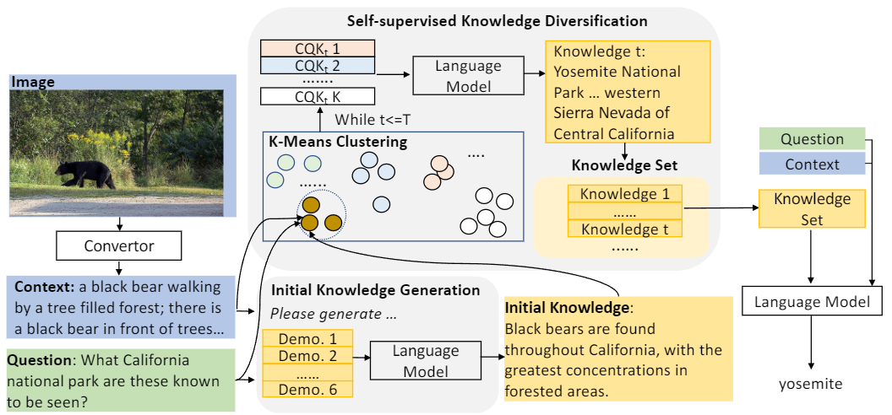

# Knowledge Generation for Zero-shot Knowledge-based VQA

This includes an original implementation of "[Knowledge Generation for Zero-shot Knowledge-based VQA][paper]" by Rui Cao, Jing Jiang.

<p align="center">
  
</p>

This code provides:
- Codes for generating relevant knowledge for knowlege-intensive VQA questions with GPT-3.
- Generated knowledge from GPT-3 for each K-VQA dataset
- Codes to incorporate the generated knowledge into K-VQA models based on 1) UnifiedQA, 2) OPT and 3) GPT-3

Please leave issues for any questions about the paper or the code.

If you find our code or paper useful, please cite the paper:
```
@inproceedings{ caojiang2024kgenvqa,
    title={Knowledge Generation for Zero-shot Knowledge-based VQA},
    author={ Rui Cao, Jing Jiang},
    journal={EACL},
    year={ 2024 }
}
```

### Announcements
01/18/2023: Our paper is accepted by EACL, 2024, as Findings. 

## Content
1. [Installation](#installation)
2. [Prepare Datasets](#prepare-datasets)
    * [Step 1: Downloading Datasets](#step-1-downloading-datasets)
    * [Step 2: Caption Generation](#step-2-caption-generation) 
4. [Knowledge Generation](#knowledge-generation) (Section 3.1 of the paper)
    * [Step 1: Knowledge Initialization](#step-1-knowledge-initialization) 
    * [Step 2: Knowledge Diversification](#step-2-knowledge-diversification) 
5. [Incorporating Generated Knowledge for K-VQA](#incorporating-generated-knowledge-for-k-vqa) (Section 3.2 and 4.3 of the paper)
    * [K-VQA based on UnifiedQA](#k-vqa-based-on-unifiedqa)
    * [K-VQA based on OPT](#k-vqa-based-on-opt)
    * [K-VQA based on GPT](#k-vqa-based-on-gpt)   

## Installation
The code is tested with python 3.8. To run the code, you should install the package of transformers provided by Huggingface (version 4.29.2), PyTorch library (1.13.1 version), LAVIS package from Salesforce (version 1.0.2). The code is implemented with the CUDA of 11.2 (you can also implement with other compatible versions) on Tesla V 100 GPU card (each with 32G dedicated memory). Besides running the OPT model, all other models take one GPU each.

###
## Prepare Datasets

### Step 1: Downloading Datasets
We have tested on three benchmarks for knowledge-intensive VQA (K-VQA) datasets: *OK-VQA* and *A-OKVQA*. Datasets are available online. You can download datasets via links in the original dataset papers and put them into the desired file paths according to the code: OK_PATH, A_OK_PATH, PATH.

### Step 2: Caption Generation
As mentioned in Section 3.2, we used text-based QA model for the final K-VQA. The images should be converted into texts (i.e., image captions) so that text-based models can comprehend. We adopt a similar approach to [PNP-VQA][pnp-vqa] to generate question-aware captions. When utilizing OPT, we follow the code for [Img2LLM][imgllm] to generate synthetic question-answer pairs as demonstrating examples. The generated captions for OK-VQA can be found in *OK_VQA/large_captions* and the captions for A-OKVQA can be found in *A_OKVQA/aokvqa_val_captions_100.pkl*. The synthetic question answer pairs for OK-VQA can be found in *OK_VQA/ok_vqa_qa_img2llm.pkl* and for A-OKVQA.  

## Knowledge Generation

Here we describe how we generate Pro-Cap with frozen pre-trained vision-language models (PT-VLMs). Specifically, we design several probing questions highly related to hateful content detection and prompt PT-VLMs with these questions and meme images. 

### Step 1: Knowledge Initialization
To alleviate noisy in input images when prompting PT-VLMs, we detect meme texts on images, remove texts and conduct image impaintings to obtain *clean images*. Due to the data privacy policy, we are unable to share the cleaned images here. Specifically, we use EasyOCR for text detection and MMEditing for image impainting. 

### Step 2: Knowledge Diversification
We next prompt frozen PT-VLMs with questions and cleaned images to obtain Pro-Cap. You can generate Pro-Cap with our code at [codes/Pro-Cap-Generation.ipynb](codes/Pro-Cap-Generation.ipynb). Or you can alternatively use generated Pro-Cap shared in [codes/Ask-Captions](codes/Ask-Captions).


### Incorporating Generated Knowledge for K-VQA
Before uploading codes, we re-run the codes. Because of the updating of the versions of transformers package, we observe a small variance compared with the reported performance in the paper. We conclude both the reported results and the re-implemented result in the Figure above. There is no significant difference according to p-value. We share both the re-implemented logger files and the logger files for the reported performance in [codes/logger](codes/logger) and [codes/reported](codes/reporte).

### K-VQA based on UnifiedQA
place holder   

### K-VQA based on OPT
place holder   

### K-VQA based on GPT
place holder   


[paper]: https://arxiv.org/abs/2308.08088
[pnp-vqa]: https://arxiv.org/pdf/2210.08773.pdf
[imgllm]: https://arxiv.org/abs/2212.10846
